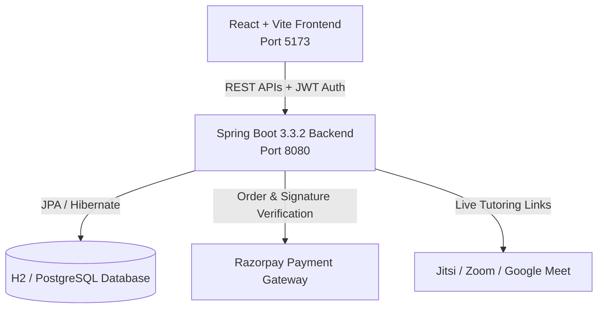

# 🎓 AV Overseas — International Academic Mentorship & Tutoring Platform

[](https://spring.io/projects/spring-boot)
[](https://reactjs.org/)
[](https://vitejs.dev/)
[](https://openjdk.org/)
[](https://razorpay.com/)
[](LICENSE)

**AV Overseas** is an enterprise-grade academic tutoring and international mentorship platform connecting global students with domain experts and advisors for degree counseling, tutoring, statement-of-purpose reviews, and technical interview preparation.

---

## 🌟 Key Highlights & Platform Features

### 1. 🛡️ Role-Based Workspaces & Portals
- **Student Workspace**: Submit assignment tutoring orders, complete Razorpay payment deposits, track milestone progress, schedule 1-on-1 walkthroughs, and collaborate with assigned mentors.
- **Expert Mentor Portal**: Manage assigned tutorials, view student requirements, review file attachments, conduct live video meetings, take notes, and track approved/released payouts.
- **Admin Console**: Full supervisory management over students registry, verified payments, 70% expert payout allocations, platform margin reports, and system audit logs.

### 2. 💳 Integrated Payments & Financial Management
- **Razorpay Online Checkout**: Verified payment gateway integration with simulated fallback for local development.
- **Independent Payments Directory**: Dynamic live calculation of distinct paying student accounts (**6 Students Paid Till Date**) derived directly from database payment records without hardcoding.
- **Dedicated Expert Payouts Ledger**: Automatic 70% tutor compensation pool allocation with Admin review, approval, and fund disbursement actions.
- **Platform Revenue & Domain Reports**: Subject-by-subject revenue breakdown (Computer Science, Data Science, AI, Business) and margin analytics (30% platform margin).

### 3. 📅 Enterprise Mentorship Meetings Module
- **Next Scheduled / Live Session Hero Card**: Real-time status badge (`LIVE NOW`, `UPCOMING`, `COMPLETED`, `CANCELLED`, `NO_SHOW`), countdown alerts, duration tracking, and instant `Join Meeting` launch actions.
- **Multi-Platform Video Integration**: Native room links for Zoom, Google Meet, and Jitsi Meet.
- **Meeting Types**:
  - `Requirement Discussion`
  - `Academic Counseling`
  - `Tutoring Session`
  - `Mock Interview`
  - `University Selection`
  - `Application Guidance`
  - `Solution Walkthrough`
  - `Follow-up Meeting`
- **Interactive Notes & Action Items Form**: Record discussion summaries, student requirements, mentor recommendations, follow-up deliverables, and next meeting targets.
- **Full History & Omnibar Search**: Instant filtering by student name, expert name, topic, meeting type, and session status.

### 4. 🔒 Privacy Guard & Workspace Collaboration
- **Privacy Redaction Engine**: Automatically redacts phone numbers, personal emails, and off-platform contact details in the live workspace chat.
- **File Asset Management**: Upload and download task documents, drafts, and completed solution archives.
- **Full Audit Trail**: Chronological event logs for all order status changes, payment confirmations, and payout disbursements.

---

## 🏗️ System Architecture



---

## ⚡ Default 1-Click Test Credentials

You can log in instantly using the **1-Click Login by Role** buttons on the sign-in page or with the credentials below:

| Role | Email Address | Password | Description |
| :--- | :--- | :--- | :--- |
| **🎓 Student** | `student@test.com` | `password123` | Alice (Student) — Active assignments & meetings |
| **🎓 Student** | `priya@test.com` | `password123` | Priya Sharma — MS Applications & Mentorship |
| **🎓 Student** | `sweety@gmail.com` | `password123` | Seety — University Selection & Tutoring |
| **🎓 Student** | `harsha@gmail.com` | `password123` | Harsha — Mock Interview & Tutoring |
| **🎓 Student** | `student@test1.com` | `password123` | Pavan — Docker & Web Development |
| **🔬 Expert** | `expert@test.com` | `password123` | Dr. Smith — Lead Academic Mentor & Tutor |
| **🛡️ Admin** | `admin@test.com` | `password123` | Bob (Admin) — Platform Supervisor & Operations |

---

## 🚀 Quick Start Guide

### Prerequisites
- **Java 17+** (or Java 21 / 25)
- **Node.js 18+** & **npm**
- **Maven 3.8+** (or use included `maven/` directory)

### 1. Clone the Repository
```bash
git clone https://github.com/HarshithaAvusula/AV-Overseas.git
cd AV-Overseas
```

### 2. Run the Spring Boot Backend
```bash
cd av-overseas-backend
mvn spring-boot:run
```
*Backend runs on `http://localhost:8080`. Database seeder automatically initializes registered users, verified payments, and mentorship meetings.*

### 3. Run the React + Vite Frontend
```bash
cd ../av-overseas-frontend
npm install
npm run dev
```
*Frontend runs on `http://localhost:5173`. Open your browser and explore the platform!*

---

## 📡 REST API Reference

### Authentication & Users
- `POST /api/v1/auth/login` — Sign in and receive JWT token
- `POST /api/v1/auth/register` — Register a new student/expert account
- `GET /api/v1/users/students` — List all registered students (Admin only)
- `GET /api/v1/users/experts` — List all domain experts

### Payments & Financials
- `POST /api/v1/payments/create-order` — Initialize Razorpay checkout order
- `POST /api/v1/payments/verify` — Verify gateway signature and record deposit
- `GET /api/v1/payments` — Get student payments log with dynamic counts
- `GET /api/v1/payouts` — Get independent expert payouts ledger
- `POST /api/v1/payouts/approve?assignmentId={id}` — Admin approves 70% expert payout
- `POST /api/v1/payouts/release?assignmentId={id}` — Admin disburses payout funds
- `GET /api/v1/reports/revenue` — Platform revenue and domain subject analytics

### Mentorship Meetings
- `GET /api/v1/meetings` — List all meetings with metadata and platform links
- `GET /api/v1/meetings/{id}` — Get single meeting session details
- `POST /api/v1/meetings/schedule` — Schedule a new mentorship session
- `POST /api/v1/meetings/{id}/notes` — Save discussion summary and recommendations
- `POST /api/v1/meetings/{id}/status` — Update session status (`LIVE`, `UPCOMING`, `COMPLETED`, etc.)

### Assignments & Collaboration
- `GET /api/v1/assignments` — List user assignments
- `POST /api/v1/assignments` — Create tutoring request
- `POST /api/v1/assignments/{id}/assign-expert` — Assign tutor to assignment
- `POST /api/v1/assignments/{id}/files` — Upload task documentation / solution archives
- `GET /api/v1/chat/assignment/{id}` — Retrieve platform workspace chat history
- `POST /api/v1/chat/message` — Send message with automated privacy redaction

---

## 📁 Repository Structure

```
AV-Overseas/
├── README.md                           # Main Platform Documentation
├── av-overseas-backend/                # Spring Boot REST API Service
│   ├── src/main/java/com/avoverseas/
│   │   ├── assignment/                 # Assignment & Order domain
│   │   ├── audit/                      # Activity logs & audit trail
│   │   ├── auth/                       # JWT Authentication & Security
│   │   ├── chat/                       # Real-time chat & privacy filters
│   │   ├── common/                     # DatabaseSeeder & configs
│   │   ├── file/                       # File uploads & storage
│   │   ├── meeting/                    # Mentorship Meetings module
│   │   ├── notification/               # In-app notification center
│   │   ├── payment/                    # Razorpay payments & revenue reports
│   │   ├── payout/                     # 70% Expert payouts ledger
│   │   └── user/                       # User management & roles
│   └── pom.xml
└── av-overseas-frontend/               # React + Vite Enterprise Dashboard
    ├── src/
    │   ├── App.jsx                     # Dashboard views, modals & state
    │   ├── index.css                   # Glassmorphism styling system
    │   └── main.jsx
    ├── package.json
    └── vite.config.js                  # Vite server & proxy configuration
```

---

## 📄 License
This project is licensed under the MIT License.
